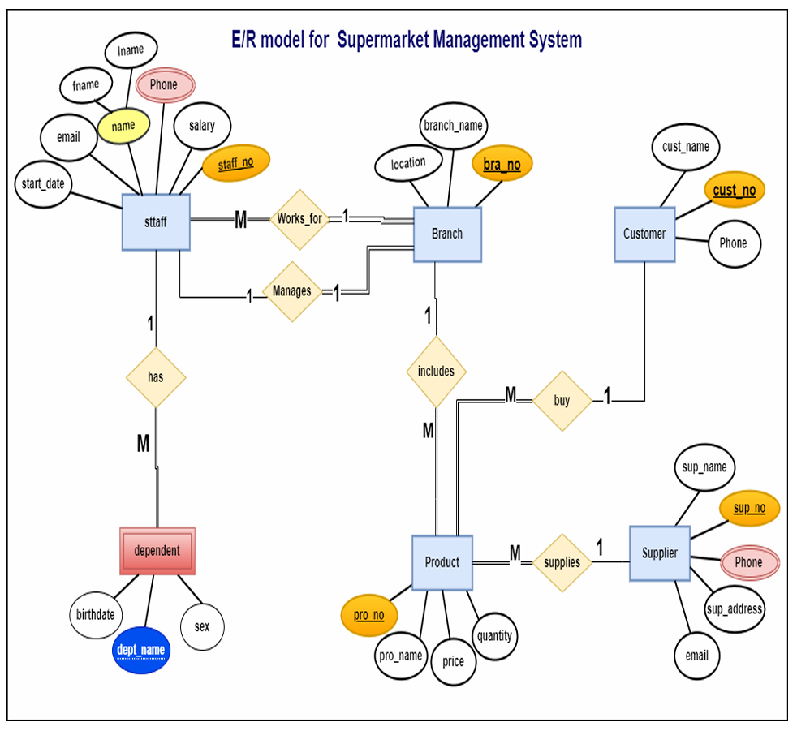
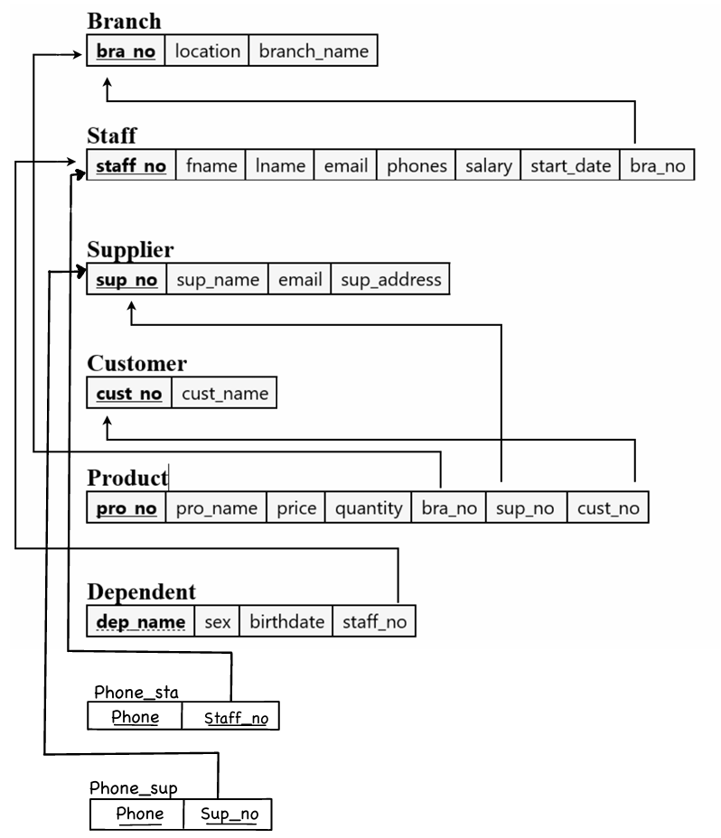

# Supermarket Management System (Database Project)

A database project for managing a supermarket system, including branches, staff, suppliers, customers, products, dependents, and phone tables.

## ✅ What I Did
- Designed the ERD and mapped it to a relational schema
- Implemented tables with PK/FK constraints
- Inserted sample data (tuples)
- Wrote SQL queries (joins, aggregation, filtering, reporting)

## 📁 Project Structure
- `sql/` SQL scripts (create tables, insert data, queries)
- `diagrams/` ERD + relational schema images
- `docs/` full documentation PDF

## 📐 Diagrams
### ERD

### Relational Schema

## ▶️ How to Run (Oracle SQL)
1. Run `sql/01_create_tables.sql`
2. Run `sql/02_insert_data.sql`
3. Run `sql/03_queries.sql`

## 🛠 Tech
SQL (Oracle-style)
